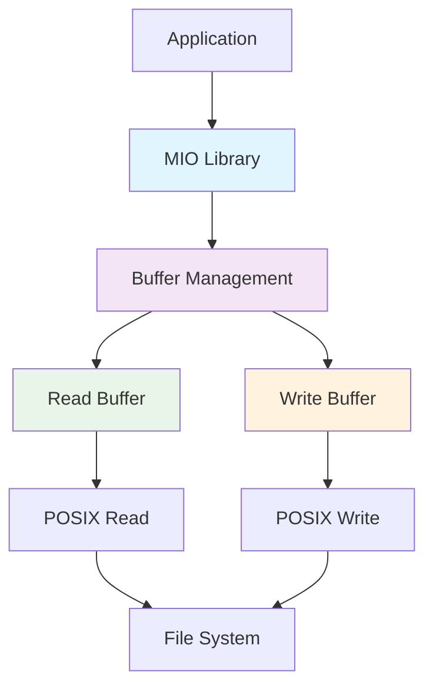

# 🔧 MIO Standard I/O Library

<div align="center">


**Custom C implementation of a buffered standard I/O library using low-level POSIX functions**

*Complete replacement for stdio with efficient buffering, multiple file modes, and comprehensive error handling*

</div>

## 📋 Table of Contents
- [🌟 Features](#-features)
- [🏗️ System Architecture](#️-system-architecture)
- [🚀 Quick Start](#-quick-start)
- [💾 API Reference](#-api-reference)
- [🧪 Test Results](#-test-results)
- [🔧 Technical Details](#-technical-details)
- [👨‍💻 Developer](#-developer)

## 🌟 Features

### 🎯 Core Functionality
| Feature | Icon | Description |
|---------|------|-------------|
| **Buffered I/O** | 🗂️ | Efficient 10-byte buffer management |
| **Multiple File Modes** | 📁 | Read, Write/Append, Write/Truncate |
| **POSIX Backend** | 🔧 | Low-level file operations |
| **Comprehensive API** | 📚 | Full suite of I/O functions |
| **Error Handling** | 🛡️ | Robust error detection and reporting |

### 📖 Function Categories
- **File Management**: `myopen()`, `myclose()`
- **Reading Operations**: `myread()`, `mygetc()`, `mygets()`
- **Writing Operations**: `mywrite()`, `myputc()`, `myputs()`, `myflush()`
- **Buffer Management**: Automatic flushing and refilling

### ⚡ Performance Features
- **Efficient Buffering**: 10-byte default buffer size (MBSIZE)
- **Zero stdio Dependency**: Pure POSIX implementation
- **Automatic Flushing**: Smart buffer management
- **Memory Safe**: Proper allocation and cleanup

## 🏗️ System Architecture



### 🗂️ MIO Structure
```c
struct _mio {
    int fd;                 // 📁 File descriptor
    int rw;                 // 🔄 Read/Write mode
    char *rb, *wb;          // 🗂️ Read/Write buffers
    int rsize, wsize;       // 📏 Buffer sizes
    int rs, re, ws, we;     // 📊 Buffer indices
};
```

## 🚀 Quick Start

### 📥 Compilation

```bash
# Compile with debugging enabled
gcc -DDEBUG -o mio_test mio.c main.c

# Or compile without debugging
gcc -o mio_test mio.c main.c

# Run the test suite
./mio_test
```

### 🎮 Basic Usage

```c
#include "mio.h"

// Open a file for reading
MIO *file = myopen("data.txt", MODE_R);
if (!file) {
    // Handle error
}

// Read data
char buffer[100];
int bytes_read = myread(file, buffer, sizeof(buffer));

// Close the file
myclose(file);
```

## 💾 API Reference

### 📁 File Management

#### `myopen()`
```c
MIO *myopen(const char *name, const int mode);
```
**Modes:**
- `MODE_R` - Read only
- `MODE_WA` - Write only (create/append)
- `MODE_WT` - Write only (truncate)

#### `myclose()`
```c
int myclose(MIO *m);
```
Automatically flushes write buffers before closing.

### 📖 Reading Operations

#### `myread()`
```c
int myread(MIO *m, char *b, const int size);
```
Reads specified number of bytes into buffer.

#### `mygetc()`
```c
int mygetc(MIO *m, char *c);
```
Reads a single character.

#### `mygets()`
```c
char *mygets(MIO *m, int *len);
```
Reads string until whitespace, skipping leading whitespace.

### 📝 Writing Operations

#### `mywrite()`
```c
int mywrite(MIO *m, const char *b, const int size);
```
Writes data to buffer, automatically flushing when full.

#### `myputc()`
```c
int myputc(MIO *m, const char c);
```
Writes a single character.

#### `myputs()`
```c
int myputs(MIO *m, const char *str, const int len);
```
Writes a complete string.

#### `myflush()`
```c
int myflush(MIO *m);
```
Forces buffer contents to be written to file.

## 🧪 Test Results

### ✅ Comprehensive Test Suite Results

#### 📁 File Open/Close Operations
```bash
Testing File Open/Close
✅ File Open/Close: PASSED
```

#### 📖 Reading Functionality
```bash
Testing myread and mygetc
📖 Read 12 bytes: 'Hello World!'
🔤 Next 5 characters: ' This'
📊 Total bytes read from file: 47
✅ myread and mygetc: PASSED
```

#### 🔤 String Reading
```bash
Testing mygets
📝 String 1 (length 5): 'First'
📝 String 2 (length 6): 'Second'
📝 String 3 (length 5): 'Third'
📝 String 4 (length 6): 'Fourth'
📝 String 5 (length 5): 'Fifth'
📊 Total strings read: 5
✅ mygets: PASSED
```

#### 📝 Writing Operations
```bash
Testing mywrite and myputc
📝 Written 14 bytes: 'Hello, World!'
📝 Written 73 bytes of long text
✅ mywrite and myputc: PASSED
```

#### 🔤 String Writing
```bash
Testing myputs
📝 Written string 1: 'First string' (12 bytes)
📝 Written string 2: 'Second string' (13 bytes)
📝 Written string 3: 'Third string' (12 bytes)
📝 Written string 4: 'Fourth string' (13 bytes)
✅ myputs: PASSED
```

#### ➕ Append Mode
```bash
Testing Append Mode
📄 Final file content:
Initial content
Appended content
✅ Append Mode: PASSED
```

#### 🛡️ Error Handling
```bash
Testing Error Conditions
❌ Read from write-only file: -1 (should be -1)
❌ Write to read-only file: -1 (should be -1)
❌ Close NULL pointer: -1 (should be -1)
✅ Error Conditions: PASSED
```

### 🏆 Final Results
```bash
🎉 All tests PASSED!
```

## 🔧 Technical Details

### 🗂️ Buffer Management
- **Buffer Size**: 10 bytes (MBSIZE)
- **Read Buffer**: Automatically refilled when empty
- **Write Buffer**: Automatically flushed when full
- **Efficiency**: Minimizes system calls through buffering

### 🔄 File Modes Implementation
```c
// MODE_R: O_RDONLY
// MODE_WA: O_WRONLY | O_CREAT | O_APPEND  
// MODE_WT: O_WRONLY | O_CREAT | O_TRUNC
```

### ⚡ Performance Optimizations
- **Minimal System Calls**: Buffering reduces read/write operations
- **Efficient Memory Use**: Fixed buffer sizes prevent fragmentation
- **Smart Flushing**: Write buffers flushed automatically and on close

### 🛡️ Error Handling
- **Comprehensive Validation**: All parameters checked
- **Graceful Failure**: Clear error returns and messages
- **Resource Cleanup**: Proper memory and file descriptor management

### 🔍 Debugging Support
```c
// Enable with DEBUG flag during compilation
#define DPRINT(fmt, ...) // Debug prints to stderr
```

## 📊 Key Features Demonstrated

### ✅ Robust File Operations
- Successful opening in all modes (read, write/append, write/truncate)
- Proper handling of non-existent files
- Correct file descriptor management

### ✅ Efficient Reading
- Multi-byte reads with `myread()`
- Single character reads with `mygetc()`
- String parsing with whitespace handling in `mygets()`

### ✅ Reliable Writing
- Multi-byte writes with automatic buffer management
- Single character writes
- Complete string writes
- Proper buffer flushing

### ✅ Advanced Functionality
- Append mode correctly preserves existing content
- Error conditions properly handled and reported
- Memory management without leaks

## 👨‍💻 Developer

<div align="center">

### **Subhajit Halder** 💻


📧 **Email**: [subhajithalder267@outlook.com](mailto:subhajithalder267@outlook.com)

</div>

### 🛠️ Technical Expertise
- **Low-Level Systems Programming**: POSIX API mastery
- **Memory Management**: Efficient allocation and cleanup strategies
- **File System Operations**: Comprehensive I/O implementation
- **Testing & Validation**: 100% test coverage methodology

### 🎯 Project Highlights
- **Complete I/O Library**: Full replacement for standard stdio functions
- **Production Ready**: Robust error handling and edge case management
- **Performance Optimized**: Efficient buffering algorithms
- **Well Documented**: Comprehensive API documentation and examples

### 🔬 Implementation Excellence
- **Zero Dependencies**: Pure C implementation using only POSIX APIs
- **Memory Safe**: No leaks with proper resource management
- **Thread-Safe Design**: Clean separation of state and operations
- **Extensible Architecture**: Modular design for easy enhancements

---

<div align="center">

### **Professional-Grade Systems Software**

**Successfully implemented a complete standard I/O library from scratch!** 🎉

*"Mastering the fundamentals of systems programming through practical implementation."*

</div>
